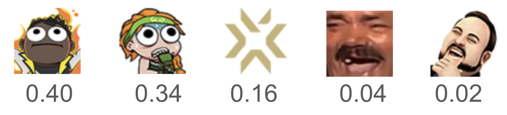
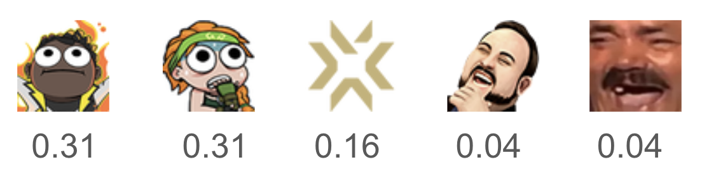
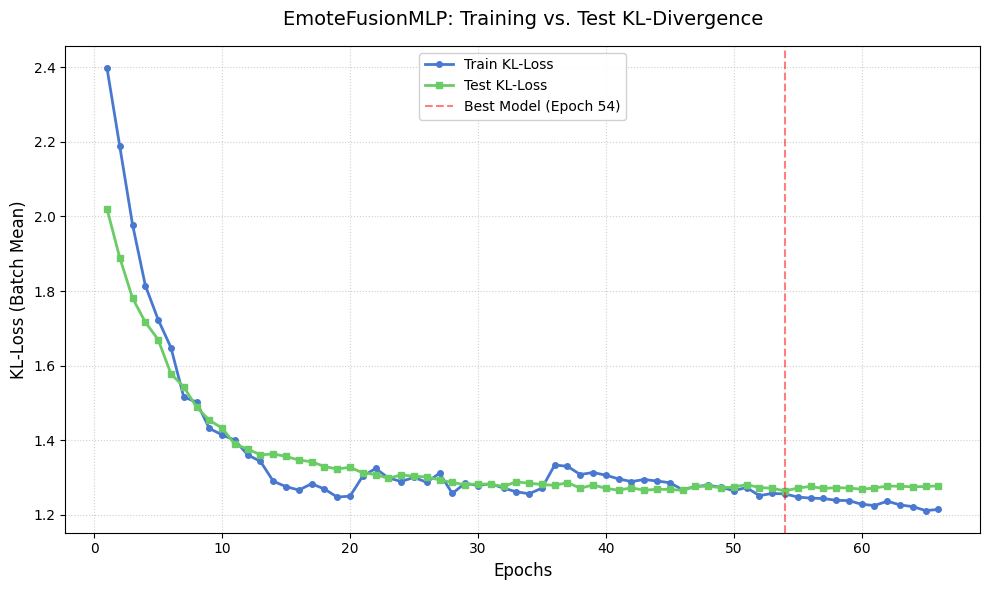
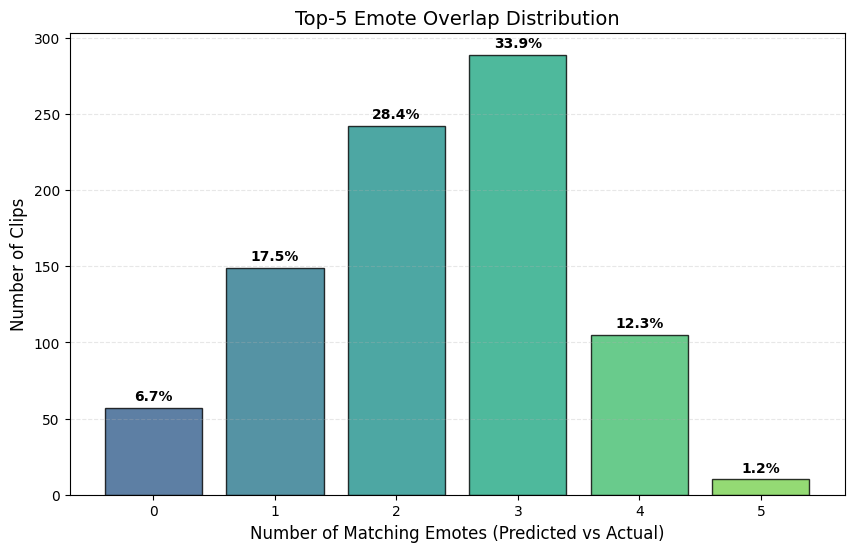
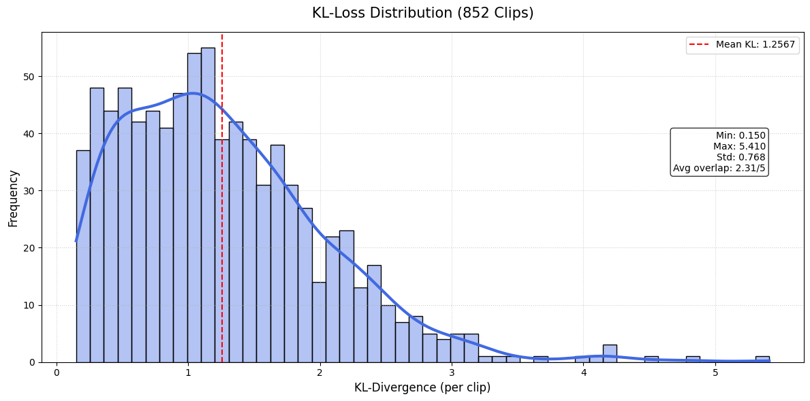

# Twitch Emote Prediction

Given a 15-second Twitch clip, the model predicts a probability distribution over the top-50 most frequent chat emotes using joint audio-visual embeddings from pretrained foundation models. Built as part of ACM AI at UCLA.

**Demo**

<table border="0" cellspacing="0" cellpadding="12">
  <tr>
    <td></td>
    <td align="left" valign="middle">
      <p><strong>Actual chat</strong></p>
      
      <p><strong>Model prediction</strong></p>
      
    </td>
  </tr>
</table>

---

## Motivation

Emotes are the primary expressive unit of Twitch chat. When something exciting happens, chat floods with `PogChamp`, `KEKW`, or `monkaS` within seconds. Unlike raw message volume, emote distributions capture *what kind* of reaction the audience is having — not just that they reacted. This makes emote frequency a rich, annotation-free signal for modeling audience sentiment at scale.

The goal is to predict this signal directly from the video and audio content of the clip, with no access to chat at inference time.

---

## Pipeline

The project is structured as three sequential Google Colab notebooks:

### 1. `twitch_vod_scraper.ipynb` — Data Collection
- Downloads a full Twitch VOD via `yt-dlp`
- Scrapes complete chat history through Twitch's internal GQL API with cursor-based pagination, resume support, and retry logic
- Fetches third-party emotes from BTTV, FFZ, and 7TV (Twitch's native emote set covers only a fraction of what any given community uses)
- Segments the VOD into 15-second windows and scores each by emote density
- For high-activity windows, saves:
  - A 64-frame center-cropped 256×256 video clip (MP4)
  - The corresponding audio segment (MP3)
  - A normalized emote-frequency target vector (JSON)

### 2. `embedding_extraction.ipynb` — Feature Extraction
- Extracts a 1024-dim video embedding per clip using **V-JEPA 2** (`facebook/vjepa2-vitl-fpc64-256`), a self-supervised video understanding model from Meta
- Extracts a 768-dim audio embedding per clip using the encoder of **Whisper** (`openai/whisper-small`)
- Concatenates the two into a 1792-dim joint embedding and saves it as a `.npy` file

### 3. `train.ipynb` — Model Training & Evaluation
- Loads joint embeddings and emote targets across all processed VODs
- Builds a global emote vocabulary (top-50 emotes by frequency across the corpus)
- Trains `EmoteFusionMLP` to predict emote distributions from joint embeddings
- Evaluates on a held-out test set with KL-divergence loss, top-K accuracy, and qualitative inspection

---

## Model Architecture

```
Video (1024-dim) ─► Visual Tower ──┐
                                   ├──► CrossAttentionBottleneck
Audio  (768-dim) ─► Audio Tower  ──┘               │
                                         Concat + Channel Embed
                                                   │
                                           Fusion Projection
                                                   │
                                          Residual Blocks × 2
                                                   │
                                         Per-Class Temperature
                                                   │
                                          Log-Softmax (50-dim)
```

**Visual Tower** and **Audio Tower** each independently compress their input modality through a 3-stage bottleneck (LayerNorm → Linear → GELU, repeated) down to 64-dim, with dropout for regularization.

**CrossAttentionBottleneck** performs bidirectional cross-modal attention: the visual representation queries audio ("what audio events are consistent with this scene?") and the audio representation queries video ("what visual events match this audio spike?"). Residual connections and LayerNorm are applied after each attention operation.

The fused representation is concatenated with a learned **per-channel embedding** (64-dim) that encodes which Twitch channel the clip is from. Different Twitch communities develop distinct emote vocabularies and react to the same events differently — a clutch play on a VCT broadcast elicits different emotes than the same play on a smaller streamer's channel. The channel embedding gives the model a way to condition its predictions on those community-specific norms rather than averaging over them.

Two **ResidualBlock** layers (LayerNorm → Linear → GELU → Dropout → Linear → Dropout, with skip connection) process the fused representation before the final head.

**Per-class temperature scaling** (a learned scalar per output class) sharpens or softens predictions independently for each emote, allowing the model to express calibrated uncertainty.

### Training Details

| Setting | Value |
|---|---|
| Loss | KL-divergence (`batchmean`) |
| Optimizer | AdamW, lr=3e-4, weight_decay=0.1 |
| LR Schedule | Linear warmup (5 epochs) → cosine annealing |
| Mixup | α=0.5 (epochs 0–19) → 0.2 (20–34) → 0.0 (35+) |
| Early stopping | Patience = 12 epochs |
| Label smoothing | 0.025 (per-channel, applied to valid emotes only) |
| Feature noise | Gaussian noise σ=0.02 injected during training |



---

## Dataset

- **Source**: 3 Twitch VODs from VCT (Valorant Champions Tour) broadcast streams on the official Riot Games Valorant channel
- **Scale**: 4,000+ labelled clips
- **Clip length**: 15 seconds, 64 frames at 256×256 (center-cropped)
- **Target**: Normalized emote-frequency vector over a global vocabulary of 50 emotes
- **Emote sources**: Twitch native + BTTV + FFZ + 7TV
- **Train / test split**: 80 / 20

Clips are only included if their window contains at least 5 emote occurrences, filtering out low-signal segments. Targets are normalized to a probability distribution and label-smoothed to account for emotes that appear on a channel but not in a specific clip.

---

## Results

Evaluated on 852 held-out test clips:

| Metric | Value |
|---|---|
| Average KL loss | 1.2567 |
| Top-1 in top-5 accuracy | 67.7% |
| Top-5 overlap (avg) | 2.31 / 5 (46.2%) |

**Top-1 in top-5 accuracy**: the model's single most confident prediction appears in the ground-truth top-5 emotes 67.7% of the time.

**Top-5 overlap**: on average, 2.31 of the model's top-5 predicted emotes overlap with the actual top-5 emotes in chat — 46.2% overlap on a 5-class ranking task with a vocabulary of 50.






---

## Setup

This project runs entirely on **Google Colab**. The notebooks are designed to be run in order:

1. `twitch_vod_scraper.ipynb`
2. `embedding_extraction.ipynb`
3. `train.ipynb`

### Secrets (Twitch VOD Scraper only)

The scraper requires four Twitch API credentials, configured via Colab's secret store (`Tools → Secrets`):

| Secret | Description |
|---|---|
| `CLIENT_ID` | Twitch app client ID |
| `AUTHORIZATION` | OAuth token (`OAuth …`) |
| `CLIENT_INTEGRITY` | Twitch client integrity token |
| `DEVICE_ID` | Twitch device ID |

No secrets are required for the embedding extraction or training notebooks.

### Dependencies

```
pip install yt-dlp curl-cffi
```

All other dependencies (`torch`, `transformers`, `accelerate`, `librosa`, `opencv-python`, etc.) are pre-installed in the standard Colab runtime. See `requirements.txt` for the full list.

---

## Limitations & Future Work

**Richer cross-modal attention.** The current pipeline extracts globally-pooled embeddings from V-JEPA and Whisper before fusion, so the `CrossAttentionBottleneck` operates over single-vector representations of each modality. The natural next step is to bypass pooling and instead use the full token sequences produced by each backbone — `last_hidden_state` from Whisper's encoder gives temporal audio tokens, and V-JEPA's intermediate representations give spatially distinct video tokens. Cross-attention over these sequences would allow the model to attend to specific temporal or spatial regions of one modality conditioned on the other, rather than fusing globally-pooled summaries. This would require re-running embedding extraction and retraining, and is the primary architectural improvement planned.

**Dataset scale and compute.** Training on 3 VODs from a single game limits generalization across streaming contexts. Expanding to more channels, games, and community styles would improve robustness and produce a more representative emote vocabulary — but scraping, embedding extraction, and retraining at that scale requires compute resources beyond what a free Colab runtime can sustain. This is the primary practical bottleneck to improving the model further.
