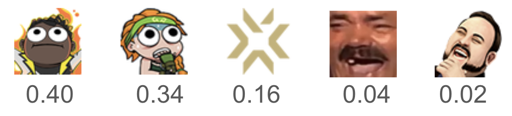
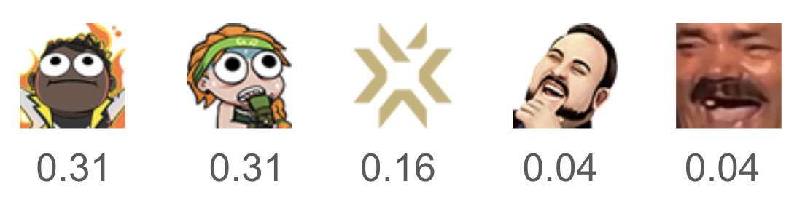
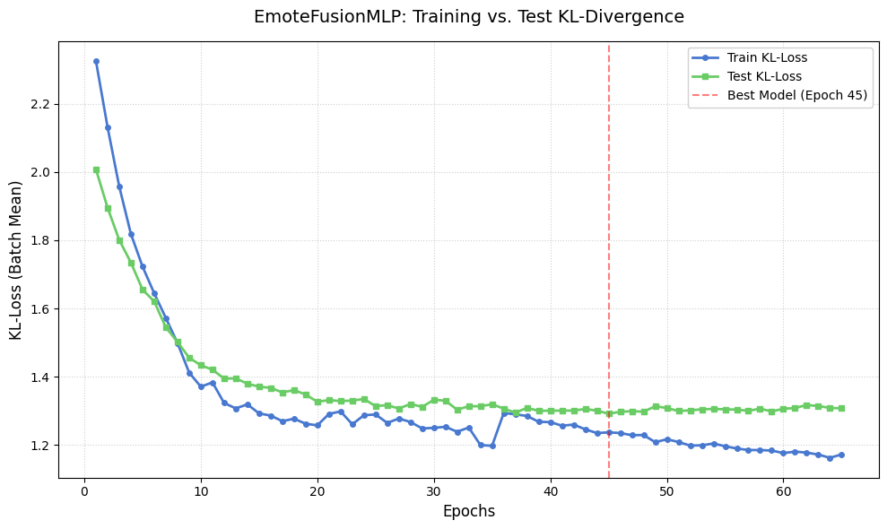
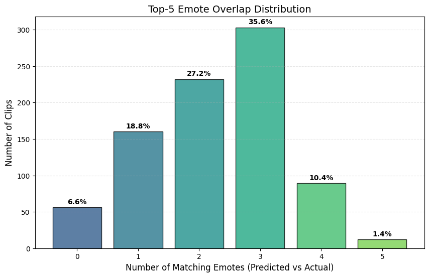
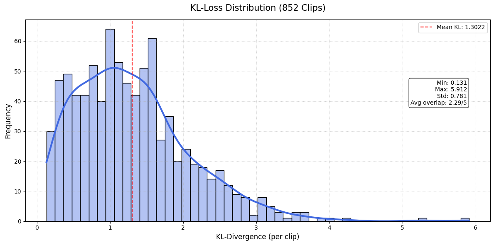

# Twitch Emote Prediction

Given a 15-second Twitch clip, the model predicts a probability distribution over the top-50 most frequent chat emotes using joint audio-visual embeddings from pretrained foundation models. Built as part of ACM AI at UCLA.

**Demo**

<table border="0" cellspacing="0" cellpadding="12">
  <tr>
    <td></td>
    <td align="left" valign="middle">
      <p><strong>Actual chat</strong></p>
      
      <p><strong>Model prediction</strong></p>
      
    </td>
  </tr>
</table>

---

## Motivation

Emotes are the primary expressive unit of Twitch chat. When something exciting happens, chat floods with `PogChamp`, `KEKW`, or `monkaS` within seconds. Unlike raw message volume, emote distributions capture *what kind* of reaction the audience is having — not just that they reacted. This makes emote frequency a rich, annotation-free signal for modeling audience sentiment at scale.

The goal is to predict this signal directly from the video and audio content of the clip, with no access to chat at inference time.

---

## Pipeline

The project is structured as three sequential Google Colab notebooks:

### 1. `twitch_vod_scraper.ipynb` — Data Collection
- Downloads a full Twitch VOD via `yt-dlp`
- Scrapes complete chat history through Twitch's internal GQL API with cursor-based pagination, resume support, and retry logic
- Fetches third-party emotes from BTTV, FFZ, and 7TV (Twitch's native emote set covers only a fraction of what any given community uses)
- Segments the VOD into 15-second windows and scores each by emote density
- For high-activity windows, saves:
  - A 64-frame center-cropped 256×256 video clip (MP4)
  - The corresponding audio segment (MP3)
  - A normalized emote-frequency target vector (JSON)

### 2. `embedding_extraction.ipynb` — Feature Extraction
- Extracts a video token sequence `[32, 1024]` per clip using **V-JEPA 2** (`facebook/vjepa2-vitl-fpc64-256`), a self-supervised video understanding model from Meta — 32 temporally-ordered vectors produced by spatially mean-pooling V-JEPA's patch tokens per temporal step
- Extracts an audio token sequence `[125, 768]` per clip using the encoder of **Whisper** (`openai/whisper-small`) — stride-6 downsampled from the encoder's 750 active frames
- Saves both sequences together as a `.npz` file

### 3. `train.ipynb` — Model Training & Evaluation
- Loads joint embeddings and emote targets across all processed VODs
- Builds a global emote vocabulary (top-50 emotes by frequency across the corpus)
- Trains `EmoteFusionMLP` to predict emote distributions from joint embeddings
- Evaluates on a held-out test set against a frequency-prior baseline, using distribution overlap, KL-divergence loss, top-K accuracy, and qualitative inspection

### Pipeline performance
The current scraper replaced an earlier version of the pipeline. Benchmarked on the same 443 clips from one VOD, its clip processing is **10× faster** (1h 39m → 9m 49s), mainly from seeking directly to each clip's audio instead of decoding the VOD from the start every time. It also fixes a sync bug: the old loop never seeked the video capture, so a clip's frames came from the wrong point in the VOD and matched neither its own audio nor its chat labels. Full results, method and raw logs are in [`benchmarks/`](benchmarks/).

---

## Model Architecture

```
Video [32, 1024] ─► Visual Tower ──┐
                                   ├──► CrossAttentionBottleneck
Audio [125, 768] ─► Audio Tower  ──┘               │
                                          Mean-pool over sequence
                                                   │
                                         Concat + Channel Embed
                                                   │
                                           Fusion Projection
                                                   │
                                          Residual Blocks × 2
                                                   │
                                         Per-Class Temperature
                                                   │
                                          Log-Softmax (50-dim)
```

**Visual Tower** and **Audio Tower** each independently compress their input modality through a 3-stage bottleneck (LayerNorm → Linear → GELU, repeated) down to 128-dim, with dropout for regularization.

**CrossAttentionBottleneck** performs bidirectional cross-modal attention: the visual representation queries audio ("what audio events are consistent with this scene?") and the audio representation queries video ("what visual events match this audio spike?"). Residual connections and LayerNorm are applied after each attention operation. The attended sequences are then mean-pooled over their sequence dimension, giving one vector per modality.

The fused representation is concatenated with a learned **per-channel embedding** (64-dim) that encodes which Twitch channel the clip is from. Different Twitch communities develop distinct emote vocabularies and react to the same events differently — a clutch play on a VCT broadcast elicits different emotes than the same play on a smaller streamer's channel. The channel embedding gives the model a way to condition its predictions on those community-specific norms rather than averaging over them.

A **fusion projection** compresses the concatenated 320-dim vector (128 visual + 128 audio + 64 channel) down to a 64-dim trunk. Two **ResidualBlock** layers (LayerNorm → Linear → GELU → Dropout → Linear → Dropout, with skip connection) then process it before the final head.

**Per-class temperature scaling** (a learned scalar per output class) sharpens or softens predictions independently for each emote, allowing the model to express calibrated uncertainty.

### Training Details

| Setting | Value |
|---|---|
| Loss | KL-divergence (`batchmean`) |
| Optimizer | AdamW, lr=3e-4, weight_decay=0.1 |
| LR Schedule | Linear warmup (5 epochs) → cosine annealing |
| Mixup | α=0.5 (epochs 0–19) → 0.2 (20–34) → 0.0 (35+) |
| Early stopping | Patience = 20 epochs |
| Label smoothing | 0.025 (per-channel, applied to valid emotes only) |
| Feature noise | Gaussian noise σ=0.02 injected during training |
| Dropout | 0.7 (fusion trunk), 0.2 (towers), 0.1 (input features) |
| Batch size | 64 |
| Max epochs | 100 (early-stopped in practice) |
| Temperature | Frozen during warmup, learned from epoch 5 onward |



---

## Dataset

- **Source**: 12 Twitch VODs across 4 Valorant channels (Riot Games Valorant, FNS, VCT Americas, VCT EMEA), scraped into 8,000+ labelled clips
- **Trained on**: the 3 VCT (Valorant Champions Tour) VODs from the official Riot Games Valorant channel — 4,000+ clips. Mixing channels degraded accuracy, so the reported run is single-channel (see [Limitations](#limitations--future-work))
- **Clip length**: 15 seconds, 64 frames at 256×256 (center-cropped)
- **Target**: Normalized emote-frequency vector over a global vocabulary of 50 emotes
- **Emote sources**: Twitch native + BTTV + FFZ + 7TV
- **Train / test split**: 80 / 20, seeded (`SPLIT_SEED = 42`) so the partition reproduces across sessions

Clips are only included if their window contains at least 5 emote occurrences, filtering out low-signal segments. Targets are normalized to a probability distribution and label-smoothed to account for emotes that appear on a channel but not in a specific clip.

---

## Results

Evaluated on 852 held-out test clips (80/20 split, `SPLIT_SEED = 42`):

| Metric | Model | Frequency prior | Uniform random |
|---|---|---|---|
| Distribution overlap | **41.8%** | 26.8% | 15.8% |
| Average KL loss | **1.3092** | 1.7516 | — |
| Top-1 exact match | **32.2%** | 16.4% | 2.0% |
| Top-1 in top-5 accuracy | **67.0%** | 45.5% | 10.0% |
| Top-5 overlap (avg) | **2.29 / 5** (45.8%) | 1.67 / 5 (33.4%) | 0.50 / 5 (10.0%) |

**Distribution overlap** is the primary measure: `sum(min(predicted, actual))` across all 50 emotes, equivalently `1 − total variation distance`. It reads as the share of chat's emote mix the model placed correctly. Unlike the ranking metrics it needs no cutoff and no `argmax`, so it evaluates the model on what it actually produces — a full probability distribution over the vocabulary.

**Average KL loss** is the training objective. Rigorous for distributions but unbounded, so it is hard to read in absolute terms; it is most useful as a relative comparison between rows.

**Top-1 exact match**: the model's most confident emote is the one chat actually used most.

**Top-1 in top-5** and **Top-5 overlap** are precision@1 and precision@5 against a 5-emote relevance set — chat's five most-used emotes for that clip. Both are easy to read, but both binarize a continuous distribution into a relevance set and discard everything below the cutoff, so they answer a narrower question than the model was trained on. They are reported for legibility, not as the primary measure.

**Baselines.** Twitch chat is top-heavy, so a predictor that ignores the clip entirely still scores well: the *frequency prior* ranks emotes by their total mass in the training clips and predicts that same ranking for every test clip, and it still places 26.8% of chat's emote mix correctly and names the top emote 16.4% of the time. The *uniform random* column is the expectation of spreading mass evenly across the 50-emote vocabulary. The model beats the prior on every metric (+15.0 pts distribution overlap, 0.4424 lower KL, +15.8 pts top-1 exact, +21.5 pts top-1-in-top-5, +0.62 top-5 overlap), which is the comparison that matters — a good fraction of the headline numbers is available without looking at the video or audio at all. Both baselines are computed in the Baselines cell of `train.ipynb`, on the same test split.

**Run-to-run spread.** An earlier evaluation of this architecture, before `SPLIT_SEED` was added, drew a different random 852-clip test set and scored 64.2% top-1-in-top-5 at KL 1.3022 — with top-5 overlap landing on the same 2.29 / 5. Treat the ranking metrics as carrying roughly ±3 points of split noise and do not read the decimal place as meaningful.

**Evaluation caveat.** The held-out set drives early stopping and checkpoint selection as well as final reporting, so it functions as a validation set and the figures above are mildly optimistic. The 80/20 split is also random over clips, and clips are consecutive 15-second windows from the same broadcasts — so a test clip's neighbours frequently appear in training. A grouped split (holding out whole VODs) would be the stricter evaluation, and would likely score lower. The baselines above received no such tuning, so the gap between the model and the frequency prior is, if anything, slightly flattered.






---

## Setup

This project runs entirely on **Google Colab**. The notebooks are designed to be run in order:

1. `twitch_vod_scraper.ipynb`
2. `embedding_extraction.ipynb`
3. `train.ipynb`

### Secrets (Twitch VOD Scraper only)

The scraper requires four Twitch API credentials, configured via Colab's secret store (`Tools → Secrets`):

| Secret | Description |
|---|---|
| `CLIENT_ID` | Twitch app client ID |
| `AUTHORIZATION` | OAuth token (`OAuth …`) |
| `CLIENT_INTEGRITY` | Twitch client integrity token |
| `DEVICE_ID` | Twitch device ID |

No secrets are required for the embedding extraction or training notebooks.

### Dependencies

```
pip install yt-dlp curl-cffi
```

All other dependencies (`torch`, `transformers`, `accelerate`, `librosa`, `opencv-python`, etc.) are pre-installed in the standard Colab runtime. See `requirements.txt` for the full list.

---

## Notes on Use

This is a research and educational project.

**Chat scraping.** The scraper reads chat history through Twitch's internal GQL endpoint — the one the web client uses, with a persisted query hash and browser-issued credentials — rather than the public Helix API, because Helix does not expose historical VOD chat. This is undocumented and unsupported, and may fall outside Twitch's developer terms. Check them before running it, and be considerate of rate limits if you do.

**Data.** No scraped data is redistributed here. The repository contains code plus a single short demo clip; VOD footage, audio, chat logs, and the derived embeddings all stay local to whoever runs the notebooks. Broadcast footage remains the property of its rights holders — the demo clip is included for illustration only.

---

## Limitations & Future Work

**Dataset scale.** The `CrossAttentionBottleneck` operates over full token sequences — 32 temporal video tokens and 125 audio tokens — allowing each modality to attend to specific moments in the other. In practice, with ~4,000 training clips the attention weights tend to collapse toward uniform across tokens, making the mechanism roughly equivalent to mean pooling. The architecture is sound but data-limited: sequence-level cross-attention needs appreciably more examples to learn meaningful temporal correspondences. More training clips is the primary path to improving the model — though see below on *which* clips.

**Cross-channel generalization.** The scraped corpus spans four channels; the reported model trains on one. Including the other channels' clips degraded accuracy enough that the corpus was restricted to the Riot Games Valorant channel. The per-channel embedding was designed for exactly this case — conditioning predictions on community-specific emote vocabularies — and at this scale it was not sufficient to absorb the shift between a tournament broadcast's chat and an individual streamer's. Whether that is a data-volume limit or an architectural one is untested: more clips *per channel*, rather than more channels, is the experiment to run.

**Compute.** Scraping, embedding extraction, and retraining at appreciably larger scale requires resources beyond what a free Colab runtime can sustain. This is the primary practical bottleneck to expanding the dataset.
