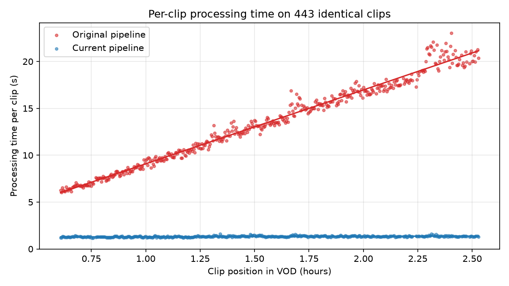

# Pipeline Benchmark

The current scraper ([`twitch_vod_scraper.ipynb`](../twitch_vod_scraper.ipynb)) replaced an earlier version of the data pipeline ([`original_pipeline.ipynb`](original_pipeline.ipynb)). This folder measures how their clip processing compares when both run on **the same clips from the same VOD**.

**Result: clip processing was 10× faster** (1h 39m 02s → 9m 49s on 443 identical clips), almost entirely from how audio is extracted.



## Results

VOD `1594760722` (6.6 h, 360p), one Colab run on 8 CPUs. Processing was stopped after 443 of 1,225 clips, covering 0.6 h to 2.5 h into the VOD.

| Step | Original | Current | Speedup |
|---|---|---|---|
| Audio extraction | 1h 36m 30s | 7m 08s | 13.5× |
| Video crop and resample | 2m 30s | 2m 40s | 0.94× |
| Target vector | 2.1s | 1.7s | — |
| **Total** | **1h 39m 02s** | **9m 49s** | **10.1×** |

Original per-clip time grows with the clip's position in the VOD, while current per-clip time stays flat:

| VOD hour | Clips | Original per clip | Current per clip | Speedup |
|---|---|---|---|---|
| 0 | 91 | 7.5s | 1.29s | 5.9× |
| 1 | 239 | 13.0s | 1.34s | 9.7× |
| 2 | 113 | 18.9s | 1.35s | 14.0× |

The speedup widens further into the VOD, so stopping at 2.5 h understates the full-VOD difference.

## What changed

### Audio extraction: input seeking instead of output seeking

The original pipeline placed `-ss` after `-i`:

```python
# original
["ffmpeg", "-y", "-i", video_path, "-ss", str(start_time), "-t", str(CLIP_DURATION), ...]
# current
["ffmpeg", "-y", "-ss", str(start_time), "-t", str(CLIP_DURATION), "-i", video_path, ...]
```

With `-ss` after `-i`, FFmpeg decodes the file from the start and discards everything before `start_time`, so a clip at 2 h decodes 2 h of audio to keep 15 s. Each clip costs more than the one before it. In this run, original audio time rose **7.9 s per hour of VOD position** (linear fit, R² = 0.98) and made up 97% of processing time. With `-ss` before `-i`, FFmpeg seeks directly to `start_time`, and audio took about 0.97 s per clip regardless of position.

### Video frames: seeking to each clip's start

The original loop computed `start_pos = int(start_time * original_fps)` but never passed it to the capture. One `cv2.VideoCapture` was opened before the loop and read sequentially, so clip *N* got the *N*-th consecutive block of the VOD instead of the window at `start_time`.

The chat target and the audio were both taken from the right place — the target from the `start_time` chat bucket, the audio from FFmpeg's `-ss start_time`. Only the video was wrong, which left it misaligned with both. In this run the first clip's window began 2,190 s into the VOD while its frames came from 0 s, and the gap widened to 2,582 s by clip 443 (median **2,289 s**, about 38 minutes) because the sequential reader walks through every second of the VOD while the clip list skips the quiet stretches between windows. The current version calls `cap.set(cv2.CAP_PROP_POS_FRAMES, start_frame)` first, and its frames were a median 0.04 s from the window.

Video processing time is about the same for both, so this was a correctness fix rather than a speedup: each clip's footage now matches the audio and chat recorded alongside it.

### Export

The original export zipped the whole output folder, including the full VOD, and downloaded it through the browser. The current export zips only the clip files and emote mapping and copies them to Drive. On this run's output, the archive went from 2.14 GB to 0.30 GB (7.2× smaller), and zipping took 13 s instead of 89 s.

## Method

- **Same inputs.** Both methods process one clip list, chosen by the original chat parser (BTTV and native emotes, at least 40 per 15 s window).
- **Interleaved.** Each clip is processed by both methods back to back, alternating which runs first, so neither consistently benefits from a warmer disk cache.
- **Independent.** Each method has its own `cv2.VideoCapture`, so the original method's sequential reading doesn't affect the current method's seeking.
- **Code as written.** Each method's processing code is copied from its notebook. The only changes are timers, logging, a readability check on the VOD file, and a whole-clip resume check in place of per-file existence checks.
- **Shared download.** The original pipeline downloaded chat and video with TwitchDownloaderCLI, which now exits with a segmentation fault on Colab (return code -11, no output). Both methods therefore use the current downloader (yt-dlp and Twitch's GQL chat API), with chat converted to the format the original parser expects.

## Caveats

- One run on one VOD. Colab hardware varies between sessions, so exact times will differ, though the trend should not.
- Stopped at 443 of 1,225 clips. The speedup grows with VOD position, so the full-VOD figure would be larger.
- Download speed is not compared, since both methods use the same downloader.
- Clip counts come from the original parser. The current scraper also counts FFZ and 7TV emotes and matches emotes inside messages, so it selects more clips from the same chat. That difference is not part of this benchmark.

## Files

| File | Contents |
|---|---|
| [`pipeline_benchmark.ipynb`](pipeline_benchmark.ipynb) | The benchmark, with saved outputs from this run |
| [`original_pipeline.ipynb`](original_pipeline.ipynb) | Earlier version of the pipeline, unmodified, for reference |
| [`results/clips.csv`](results/clips.csv) | One row per clip: per-step times for both methods, VOD position, frame source positions |
| [`results/per_vod_hour.csv`](results/per_vod_hour.csv) | Mean per-clip times by hour of VOD position |
| [`results/stages.json`](results/stages.json) | Wall time and details for each stage |
| [`results/summary.json`](results/summary.json) | Every derived number from the analysis cells |
| [`results/environment.json`](results/environment.json) | Python, FFmpeg, OpenCV and yt-dlp versions, CPU and RAM |
| [`results/events.log`](results/events.log) | Timestamped run log |
| [`plot_results.py`](plot_results.py) | Regenerates the chart from `clips.csv` |

## Reproducing

1. Open `pipeline_benchmark.ipynb` in Colab and add the same four secrets the scraper uses (`CLIENT_ID`, `AUTHORIZATION`, `CLIENT_INTEGRITY`, `DEVICE_ID`).
2. Set `VOD_ID`. Longer VODs show a larger difference.
3. Run all. A full run takes hours, nearly all of it the original method. Set `CLIP_STRIDE` to process every Nth clip; totals are scaled to the full clip list.
4. Logs are written to Google Drive as the run progresses. If the runtime disconnects, set `RESUME_LOG_DIR` to the printed log folder and re-run.

To regenerate the chart locally: `python benchmarks/plot_results.py` (requires `numpy` and `matplotlib`).
